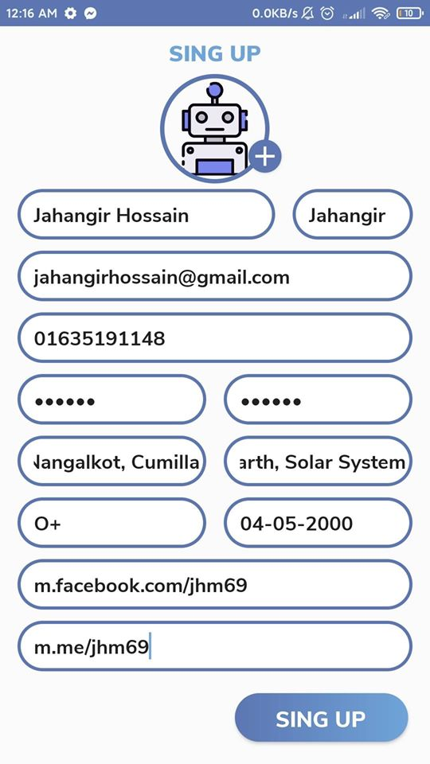
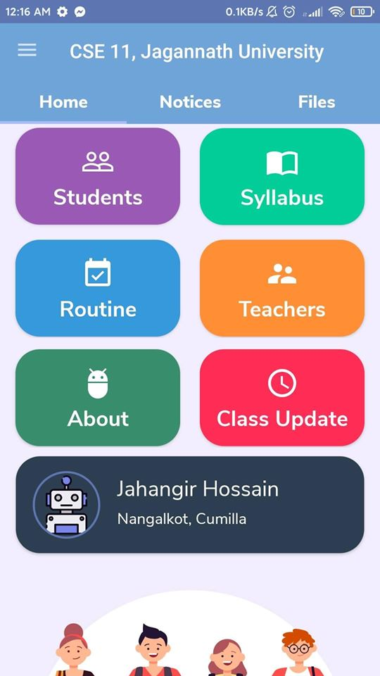
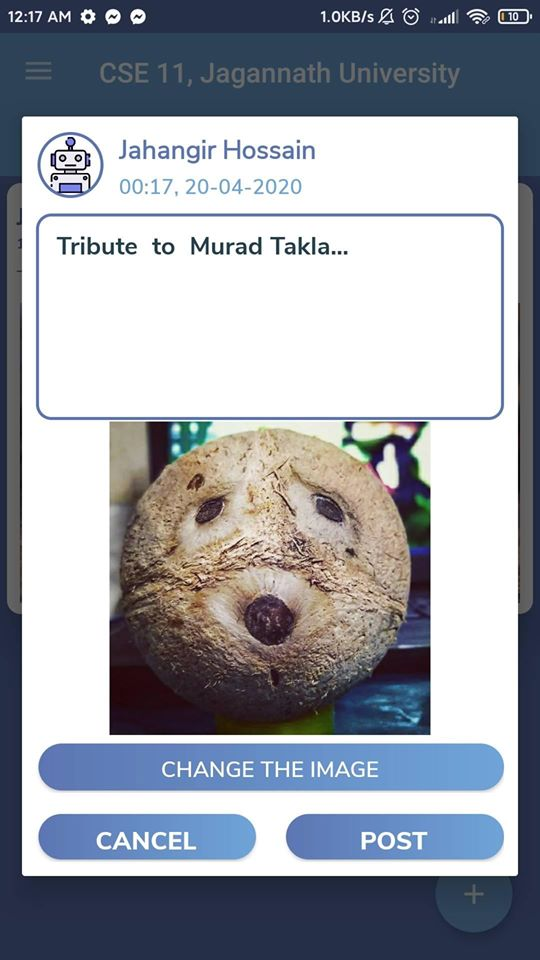
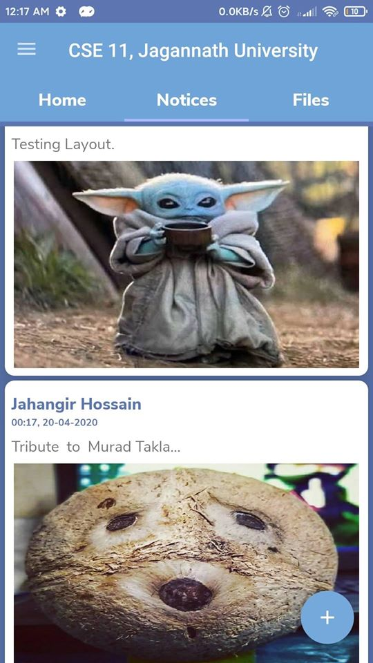
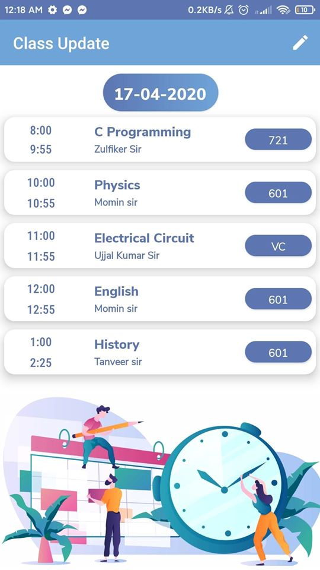
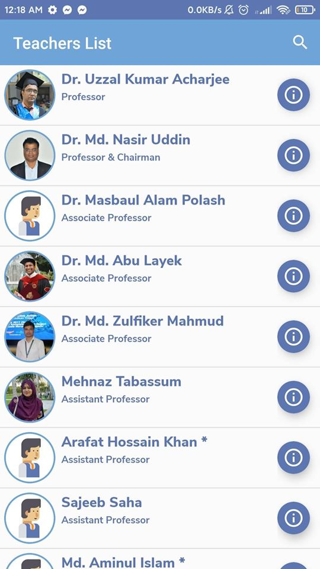
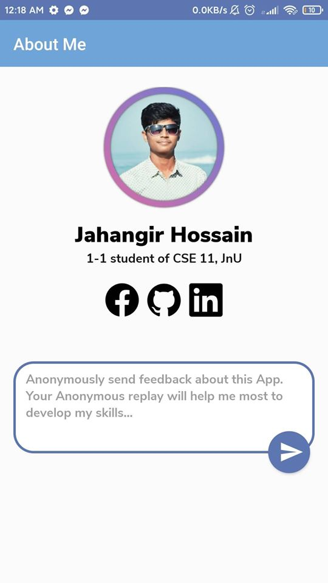

An Android app about my dept. You can find All contact information's of both teacher's and students here in this app including phone numbers, blood group and address. 
You can get notice and class update in this app with exciting annimated images. Also you can get important file update here in the app. This app also contain CLASS ROUTINE and SYLLABUS so that students can find the infos ASAP.
2nd Version of my dependent's Android app is ready.
Change log:

*Added log in, Sing up option.

*Added Add post with photo

*Implemented a model activity to visualize Every Class Update given by CR.

*CR can update ClassUpdate

*Searching students bug has been fixed.

*Updated UI and used some colors.

*Shifted to Firebase as back end Database.

*Added some bugs to fix later.

Link: https://drive.google.com/uc?id=1CMzFV9bStDdR-ngk01cTb-uPyfw-PE1M&export=download
 
 
 
 
 
 
 
 

